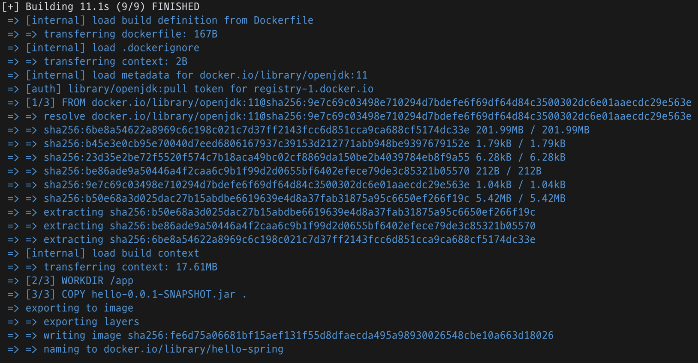

# 1. 기본 Docker 명령어 (build, run, stop)

## 1.1. Docker 명령어 수행 요약


- `build` : Dockerfile 기반으로 Docker Image 를 생성합니다.

- `run` : Image 를 기반으로 Container 를 생성/실행 합니다. `--rm` 옵션이 존재 할 경우 Container 종료시 Conatianer 를 삭제 합니다.

- `stop` : 실행중인 Conatianer 를 중지합니다.

- `start` : 삭제 되지 않은 Container 일 경우 다시 실행합니다.


## 1.2. Docker 파일 생성

```dockerfile
FROM openjdk:11

WORKDIR /app

COPY ./build/libs/hello-0.0.1-SNAPSHOT.jar .

EXPOSE 8080

CMD ["java", "-jar", "hello-0.0.1-SNAPSHOT.jar"]
```

Dockerfile 은 Docker Image 를 build 할 수 있는 명령어들을 기술한 텍스트 파일입니다. 위의 예시의 의미는 다음과 같습니다.

- `FROM` : Docker 에서 제공하는 Base Image 기술
- `WORKDIR` : 이미지내부에서 작업 디렉토리 선정
- `COPY {from} {to}` : localhost 의 특정 위치의 파일을 Docker 이미지 내부의 특정위치로 복사
- `EXPOSE` : 특정 포트 노출. 예시에서는 3000번 포트 노출 
- `CMD` : 배열형태로 주어진 명령어를 실행 

위의 예시에서 실행하는 jar 파일은 Spring Boot 로 생성한 간단한 REST API 예제 어플리케이션 입니다. `GET http://localhost:8080/hello` 또는 `GET http://localhost:8080/hello?name=Tom` 형태의 응답만 처리 할 수 있는 어플리케이션이며  간단한 응답만처리하는 어플리케이션이므로 직접 작성해도 되고, 아래 소스를 다운받아 빌드하면 동일하게 테스트 가능합니다.

> 해당 Spring Boot 예시 소스 링크
> 
> [GitHub - doublejkim/HelloWorld: GET 응답 테스트용](https://github.com/doublejkim/HelloWorld)


## 1.3. Build, Run

```shell
docker build .   # Dockerfile 이 존재하는 위치에서 build

# docker image build 할 때 명시적인 tag설정 // tag 를 설정하면 image-id 대신에 사용가능
docker build -t reponame:tag .

docker run -p 8080:8080 {images-id}

# Background 로 실행, 종료시 Container 삭제 
docker run -p 8080:8080 -d --rm --name {container-name} {image-id or reponame}
```

build 완료후 image-id 를 확인 할 수 있는데  `run` 명령어 실행시 파라미터로 전달 가능합니다. 만약 build 시 에 `-t` 옵션으로 이미지명(reponame) 을 지정했다면 이미지명 으로도 실행 가능합니다.



`docker build -t hello-spring .` 명령어로 이미지 빌드를 진행해보겠습니다. build 가 정상적으로 수행되면 위와같이 모든 작업이 Finished 되고


`docker images` 명령어로 생성된 이미지를 확인할 수 있습니다.  항목에서는 이미지명(hello-spring)과 image-id(fe6d75a06681) 을 확인 할 수 있습니다. 이미지명을 명시적으로 지정하지 않은 경우에는 image-id 로만 실행 할 수 있습니다.


`docker run -d --rm -p 8080 --name hello hello-spring` 으로 실행한 결과 입니다. 정상적으로 실행 후에는  `docker ps` 명령어로 확인하면 실행중인 docker container 를 확인 할 수 있습니다.  


컨테이너 실행 후에 위와 같이 GET 요청을 보낼경우 정상 수행하는 것을 확인 가능합니다.


```shell
docker run -p 8080:8080 -it {docker-id}
```

만약 표준입력으로 입력을 받아야하는 상황에서는 위와 같이 interfactive , tty 옵션을 주어 실행할 수 있습니다.

```shell
docker tag node-demo:latest {dockerhub-id}/{newname}:{addtionaltag}
```

Dockerhub 에 Docker Image 를 push 하려면 저장소 이름과 동일해야하는데 그럴때 tag 명령어를 이용하여 위와같이 변경하는 것이 가능합니다.

## 1.4. Stop, Start

```shell
docker stop {image-name/container-id}
```

실행 중인 Docker image 를 중지하려면 위와 같이 입력 합니다.

```shell
docker start {image-name/container-id}
```

한번 생성되었던 컨테이너라면 start 명령어로 다시 컨테이너 시작 가능 합니다. `docker run` 수행 시에 `--rm` 옵션을 사용하지 않아서 종료 후에도 컨테이너가 삭제 되지 않았어야 `start` 명령어로 실행이 가능합니다. 

- start 로 컨테이너를 시작할 경우 detach 모드가 default 

```shell
docker start -i {image-name/container-id}
```

만약 실행시 시스템 파라미터로 입력이 필요한 상황이라면 위와 같이 interactive 옵션을 주어 실행 가능 

## 1.5. Attach

```shell
docker run -p 8080:8080 -d {image-id or reponame}
```

위와 같이 run 으로 컨테이를 실행시킬때 `-d` 옵션을 사용하여 명시적으로 detach 모드로 실행하거나

```shell
docker start {container-name/container-id}
```

다음과 같이 start 명령어로 default 가 detach 인 상태로 실행이 되어 현재 컨테이너에 detached 되어있을때 attach 명령어로 attach 가능합니다.

```shell
docker attach {container-name/container-id}
```

```shell
docker start -a {container-name/container-id}
```

위와 같이 start 와 동시에 attached 모드로 실행도 가능합니다. attached 모드로 실행하면 컨테이너 내부에서 실행되고 있는 상황을 확인 할 수 있습니다.

## 1.6. Logs

```shell
docker logs {container-name/container-id}
```

기존의 로그를 확인할 수 있습니다.  `-f` 옵션을 사용하면 attach 를 사용하여 모니터링하고있는 결과 와 동일합니다.

## 1.7. rm / rmi

```shell
docker ps -a # 모든 컨테이너 목록을 조회 후 

docker rm {contianer-id/container-name}. # 컨테이너 삭제 

docker images # 생성된 모든 image 조회 후

docker rmi {image-id} # 특정 이미지 삭제
중
```

중지중인 컨테이너를 삭제하거나, 필요없는 이미지를 삭제할 경우에 사용하는 명령어 입니다.

- docker image prune 이라는 강제 삭제도 있음

- run 명령어 수행시 --rm 옵션을 사용하면 컨테이너 종료시에 자동으로 삭제됨

## 1.8. images / image

```shell
docker images # 생성된 모든 이미지 리스트 조회 

docker image inspect {image-id} # 특정 이미지의 정보 조회 
```

## 1.9. 복사 (cp)

```shell
docker cp dummy/. {container-name}:/{folder-name}
```

- 실행 중인 컨테이너의 컨테이너 이름을 사용해야 함
- 옵션에 폴더명을 기술하면 해당 컨테이너 내의 해당 폴더로 타겟이 정해지게된다. 폴더가 존재하지 않는다면 폴더가 생성
